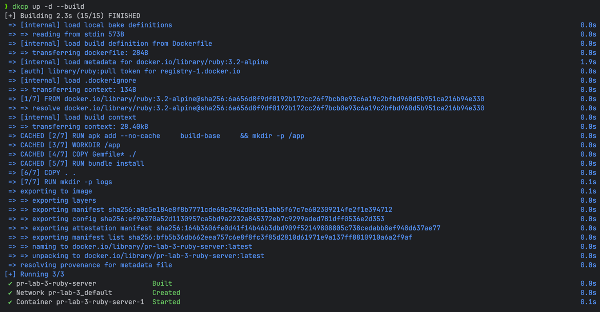
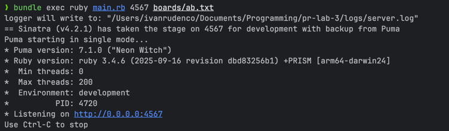
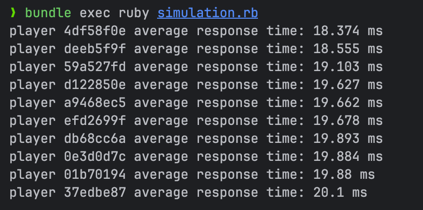

## Lab 3: Memory Scramble Game

### Course: PR

### Author: Rudenco Ivan

---
### Task
To implement the MIT 6.102 (2025) Memory Scramble lab in any programming language.

### Contents of the source directory

```
pr-lab-3/
├── .bundle/
├── boards/                      # board files
├── config/                      # puma server config
├── lib/
│   ├── board/          
│   │   ├── board.rb             # board adt
│   │   ├── board_operations.rb  # game rules implementation
│   │   └── board_utils.rb       # helper methods
│   ├── controllers/
│   │   ├── request_queue.rb     # request queue adt
│   │   └── server_logger.rb     # request logger
│   └── commands.rb              # look/flip/map/watch interfce
├── public/                      # web ui
├── tests/       
│   ├── flip_test.rb             # flip method tests
│   ├── look_test.rb             # look method tests
│   ├── map_test.rb              # map method tests
│   └── watch_test.rb            # watch method tests
├── .dockerignore
├── .gitignore
├── docker-compose.yaml
├── Dockerfile
├── Gemfile
├── Gemfile.lock
├── main.rb                      # server entry point
├── README.md
└── simulation.rb                # client simulation
```

### Docker files
`Dockerfile`:
```
FROM ruby:3.2-alpine

RUN apk add --no-cache \
    build-base \
    && mkdir -p /app

WORKDIR /app
COPY Gemfile* ./

RUN bundle install

COPY . .

RUN mkdir -p logs

EXPOSE 4567
ENV RACK_ENV=production

CMD ["bundler", "exec", "ruby", "main.rb"]
```

`docker-compose.yaml`:
```
services:
  ruby-server:
    build: .
    ports:
      - "4567:4567"
    command: ["bundler", "exec", "ruby", "main.rb", "4567", "boards/ab.txt"]
```

### Starting the server with Docker
Run `docker compose up -d --build`:



Game will be accessible at `http://localhost:4567/`.

### Starting the server (without Docker)
Prerequisites: Ruby 3.4.6+

Install and run:

```
bundle install
bundle exec ruby main.rb 4567 boards/ab.txt
```



### Playing the game in the browser
After running the server, the game's web ui will be available at `http://localhost:4567/`. Each browser tab will be counted as a new player.


### Concurrent players simulation
File `simulation.rb` simulates 10 concurrent http clients making 100 moves each with 0.1 - 2 ms timeouts. After they finish making moves, it prints average response time for every client.

After starting the game's server with a large board(like, 40by40.txt), run the simulation in a new terminal session with `bundle exec ruby simulation.rb`.

Results should look like this:



### Implementation details

- `Board` ADT is implemented in the `board.rb`. It is responsible for board representation, as well as tracking the game state. Game state is stored exclusively in the cards and each card has value, state, and owner.
- `RequestQueue` ADT implements the main queue that processes incoming requests. It also has a secondary queue that keeps track of any waiting requests and reschedules them in correct order. There is also a third queue, that holds current watch requests from players who use watching mode.
- `BoardOperations` contains the implementation of `look`, `flip`, `map`, and `watch` methods of the `commands.rb` interface.
- `config/puma.rb` defines the minimum and maximum number of threads that the server can use. For processing big boards, especially in watch mode, the max threads number should be increased accordingly. 